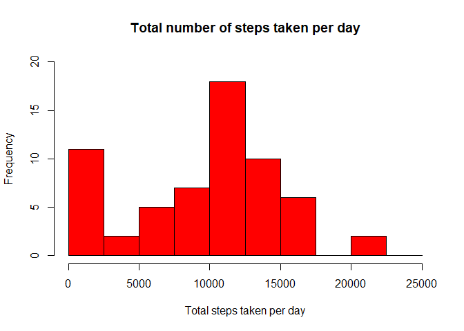
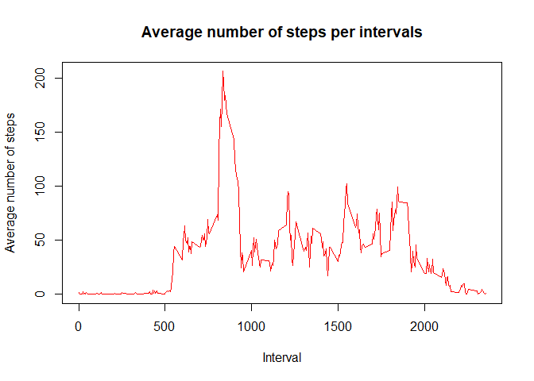
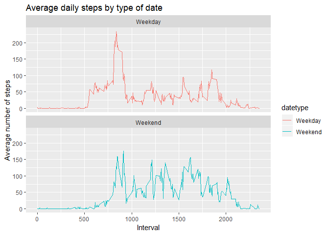

### Loading and preprocessing the data


```r
library(ggplot2)

activity <- read.csv("data/activity.csv")

activity$date <- as.POSIXct(activity$date, format="%Y-%m-%d")
weekday <- weekdays(activity$date)
activity <- cbind(activity,weekday)

summary(activity)
```

```
##      steps             date               interval           weekday    
##  Min.   :  0.00   Min.   :2012-10-01   Min.   :   0.0   Friday   :2592  
##  1st Qu.:  0.00   1st Qu.:2012-10-16   1st Qu.: 588.8   Monday   :2592  
##  Median :  0.00   Median :2012-10-31   Median :1177.5   Saturday :2304  
##  Mean   : 37.38   Mean   :2012-10-31   Mean   :1177.5   Sunday   :2304  
##  3rd Qu.: 12.00   3rd Qu.:2012-11-15   3rd Qu.:1766.2   Thursday :2592  
##  Max.   :806.00   Max.   :2012-11-30   Max.   :2355.0   Tuesday  :2592  
##  NA's   :2304                                           Wednesday:2592
```


### What is mean total number of steps taken per day?


```r
activity_total_steps <- with(activity, aggregate(steps, by = list(date), FUN = sum, na.rm = TRUE))
names(activity_total_steps) <- c("date", "steps")
hist(activity_total_steps$steps, main = "Total number of steps taken per day", xlab = "Total steps taken per day", col = "red", ylim = c(0,20), breaks = seq(0,25000, by=2500))
```

<!-- -->

```r
print(paste("Mean of Total number of steps taken per day: ", mean(activity_total_steps$steps)))
```

```
## [1] "Mean of Total number of steps taken per day:  9354.22950819672"
```

```r
print(paste("Median of Total number of steps taken per day: ", median(activity_total_steps$steps)))
```

```
## [1] "Median of Total number of steps taken per day:  10395"
```


### What is the average daily activity pattern?


```r
average_daily_activity <- aggregate(activity$steps, by=list(activity$interval), FUN=mean, na.rm=TRUE)
names(average_daily_activity) <- c("interval", "mean")
plot(average_daily_activity$interval, average_daily_activity$mean, type = "l", col="red", lwd = 1, xlab="Interval", ylab="Average number of steps", main="Average number of steps per intervals")
```

<!-- -->

```r
avg_interval<-average_daily_activity[which.max(average_daily_activity$mean), ]$interval

print(paste("Avg. Interval: ", avg_interval))
```

```
## [1] "Avg. Interval:  835"
```


### Imputing missing values


```r
print(paste("Empty Values: ", sum(is.na(activity$steps))))
```

```
## [1] "Empty Values:  2304"
```

```r
imputed_steps <- average_daily_activity$mean[match(activity$interval, average_daily_activity$interval)]

activity_imputed <- transform(activity, steps = ifelse(is.na(activity$steps), yes = imputed_steps, no = activity$steps))
total_steps_imputed <- aggregate(steps ~ date, activity_imputed, sum)
names(total_steps_imputed) <- c("date", "daily_steps")

hist(total_steps_imputed$daily_steps, col = "darkblue", xlab = "Total steps per day", ylim = c(0,30), main = "Total number of steps taken each day", breaks = seq(0,25000,by=2500))
```

<!-- -->

```r
print(paste("Mean of Total number of steps taken per day: ", mean(total_steps_imputed$daily_steps)))
```

```
## [1] "Mean of Total number of steps taken per day:  10766.1886792453"
```

```r
print(paste("Median of Total number of steps taken per day: ", median(total_steps_imputed$daily_steps)))
```

```
## [1] "Median of Total number of steps taken per day:  10766.1886792453"
```


### Are there differences in activity patterns between weekdays and weekends?


```r
activity$date <- as.Date(strptime(activity$date, format="%Y-%m-%d"))
activity$datetype <- sapply(activity$date, function(x) {
    if (weekdays(x) == "Saturday" | weekdays(x) =="Sunday") 
    {y <- "Weekend"} else 
    {y <- "Weekday"}
    y
})

activity_by_date <- aggregate(steps~interval + datetype, activity, mean, na.rm = TRUE)
plot<- ggplot(activity_by_date, aes(x = interval , y = steps, color = datetype)) +
    geom_line() +
    labs(title = "Average daily steps by type of date", x = "Interval", y = "Average number of steps") +
    facet_wrap(~datetype, ncol = 1, nrow=2)
print(plot)
```

<!-- -->

